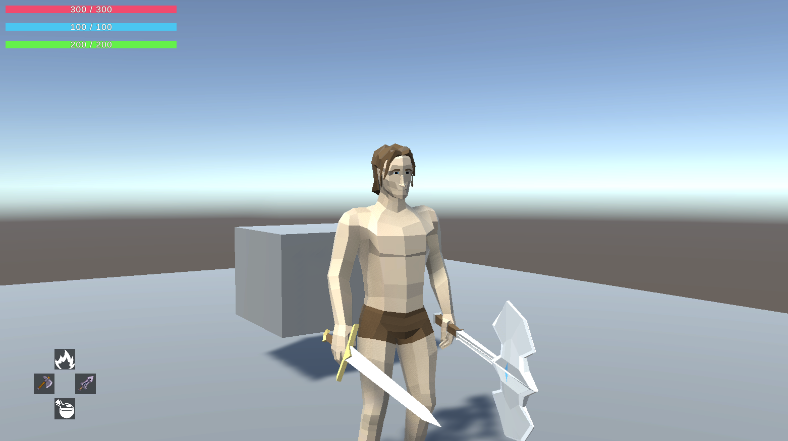
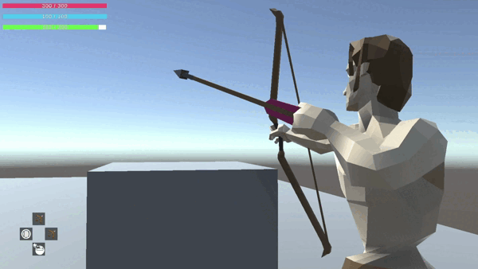

# Unity Soulslike RPG - Open Template

## Overview

This is an open-source Unity project for a Soulslike RPG, inspired by what I've learned building _Cacildes Adventure_ ([Steam Link](https://store.steampowered.com/app/2617740/Cacildes_Adventure/)). The project is currently in development and will feature core mechanics typical of the Soulslike genre, providing a foundation for developers to build upon.

## Planned Features

- **Combat System**

  - Stamina-based attacks, dodges, and blocks
  - Light and heavy attacks with various weapon types
  - Parry and riposte mechanics
  - Archery system
    

- **RPG Elements**

  - Character leveling and stat progression
  - Equipment and inventory system
  - NPC interactions and quest system

- **Enemy AI**

  - Pattern-based enemy behavior
  - Aggro and detection systems
  - Boss battles with unique attack phases

- **Exploration & World Design**

  - Checkpoints (Bonfire-like system)
  - Environmental storytelling and lore elements (books)

- **Not Planned Initially**
  - PvP and co-op mechanics
  - In-game messages and player interactions

## Getting Started

### Prerequisites

- Unity 2021 or later
- C# programming knowledge
- Basic understanding of Unity’s animation and physics systems

### Installation

1. Clone or download this repository
2. Open the project in Unity
3. Run the game scene and start exploring!

## Contribution & Usage

This project is free to use, modify, and distribute. Feel free to contribute by submitting pull requests or suggestions.

## Credits

Third-party assets are listed in the project's main scene itself, with direct links to the authors.

---

Stay tuned for updates as new features roll out!
