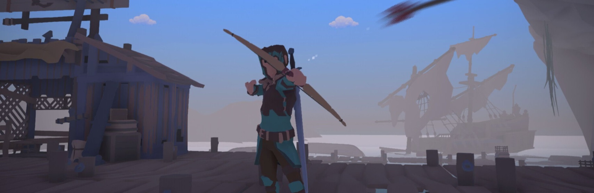

# Cacildes Adventure 2

**Cacildes Adventure 2** is a Soulslike RPG developed in Unity, serving as the sequel to [Cacildes Adventure](https://store.steampowered.com/app/2617740/Cacildes_Adventure/). This repository contains all the C# scripts used in the game, covering core gameplay mechanics such as combat, dialogue, choices, merchants, spells, archery, bonfire system, and level-up progression.

## Features

- **Soulslike Combat System** – Lots of bosses, precise hitboxes, stamina & mana management, one / two handing weapons, dodging, blocking, and parries
- **Dialogue & Choices** – Interactive dialogue with choices
- **Shop & Economy** – Merchant system with item purchasing and selling
- **Magic & Archery** – Fully implemented spellcasting and ranged combat mechanics
- **Bonfire System** – Checkpoints for resting, respawning enemies, fast travelling and character progression
- **Level-Up & Stats** – RPG progression with experience points, attributes, and character builds
- **Save & Load System** – Persistent game progress with manual and auto-save functionality
- **Inventory Management** – A structured inventory system allowing item collection, usage, and organization

## Repository Structure

```
/cacildes-adventure-2
│-- AI/                      # State Machine for AI (companions and enemies)
│-- Achievements/            # Achievements for Steam
│-- Alchemy/                 # Alchemy and potion crafting mechanics
│-- Animations/              # Misc scripts for animation controllers, states and clip overrides
│-- Arena/                   # Arena mode, a minigame from the first game. Will probably not be featured in the sequel
│-- Audio/                   # Audio management scripts
│-- Bonfires/                # Bonfire system scripts
│-- Books/                   # In-game readable books scripts
│-- Cards/                   # Card game mechanics scripts
│-- Changelog/               # Changelog and version history
│-- Characters/              # Character-related scripts
│-- Coins/                   # Currency and coin management scripts
│-- Combat/                  # Combat mechanics scripts
│-- Companion/               # Companion AI and interaction scripts
│-- Conditions/              # Status effects and conditions scripts
│-- Crafting/                # Item crafting system scripts
│-- Credits/                 # Game credits scripts
│-- Damage/                  # Damage calculation for characters
│-- Day and Night/           # Day and night cycle scripts
│-- Detection/               # Detection and stealth mechanics scripts
│-- Dialogue/                # Dialogue system scripts
│-- EditMode_Tests/          # Unit tests, mostly for the more important stuff like formulas and some static utils
│-- Equipment/               # Equipment and inventory scripts
│-- Events/                  # Event system used in a lot of cutscenes to sequence in-game events
│-- Flags/                   # Flag system to track what the player has done in the game world (opened chest; picked item; talked to a certain character; etc...)
│-- Footsteps/               # Footstep sounds scripts
│-- Formulas/                # Game formulas and calculations
│-- GUIDs/                   # Global Unique Identifiers
│-- Graphics/                # Graphics settings and management scripts
│-- Health/                  # Health management scripts
│-- Inventory/               # Inventory system scripts
│-- Items/                   # Item definitions and scripts
│-- Ladders/                 # Ladder climbing mechanics scripts
│-- Loading/                 # Loading screen scripts
│-- Localization/            # Localization and translation scripts
│-- Misc/                    # Miscellaneous scripts
│-- Particles/               # Particle effects scripts
│-- Pickups/                 # Item pickup mechanics scripts
│-- Player/                  # Player-related stuff
│-- Puzzles/                 # Puzzle mechanics scripts
│-- Quest/                   # Quest system scripts
│-- Recipes/                 # Crafting recipes scripts
│-- Save/                    # Save and load system scripts
│-- Scenes/                  # Game scenes
│-- Settings/                # Game settings scripts
│-- Shops/                   # Shop and merchant scripts
│-- Skills/                  # Skill system scripts
│-- Spells/                  # Spellcasting system scripts
│-- Stats/                   # Character stats scripts
│-- Swimming/                # Swimming mechanics scripts
│-- Time/                    # Time management scripts
│-- Tools/                   # Editor tools and utilities
│-- UI/                      # User Interface scripts
│-- Weapons/                 # Weapon mechanics scripts
│-- World/                   # World interaction scripts
│-- README.md                # Project documentation
```

## About this project

This project has been in development since 2021.

Cacildes Adventure 1 was released on Steam on April 2024. I've developed two expansions for the game during the summer of 2024.

Cacildes Adventure 2 started development in September 2024. This will be the repository to host all the code throughout development. Stay tuned!

## Contribution

Although I am developing this game solo, I welcome any suggestions or code improvements you may have. Feel free to fork this project if you'd like! While I can't share the full source due to the use of commercial assets from the Unity Asset Store, I'm happy to provide insights or a walkthrough on how the code is structured—just reach out!

## License

_[Specify license]_
